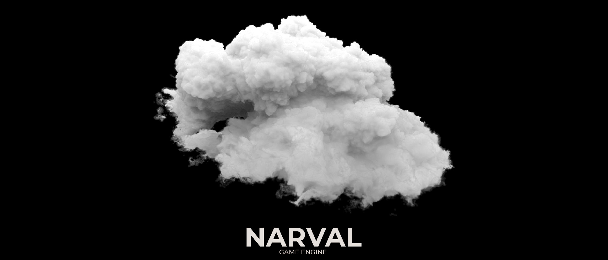
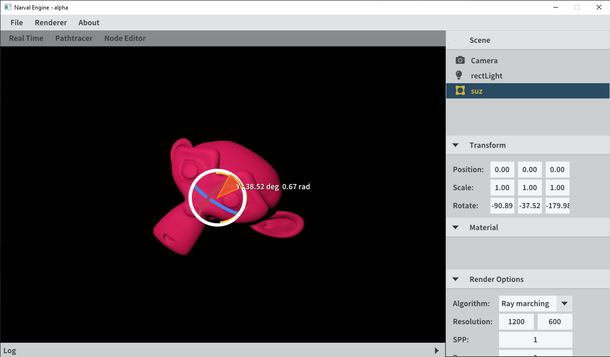
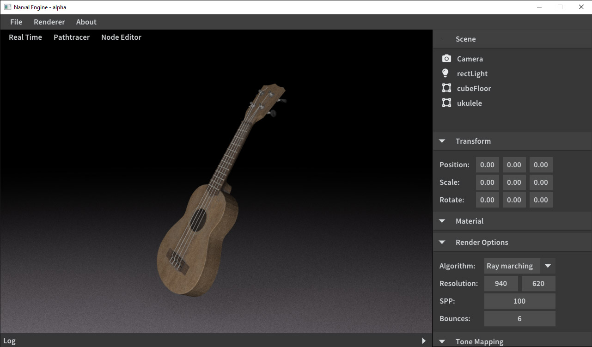
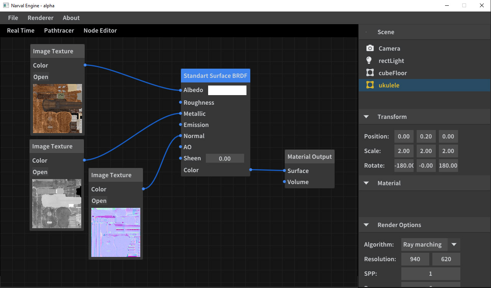
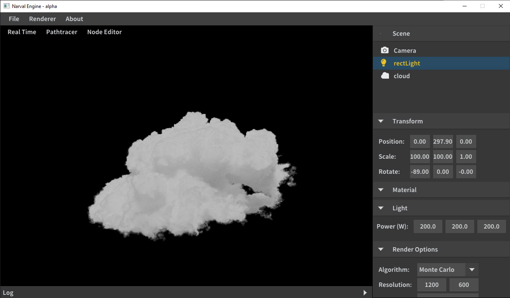
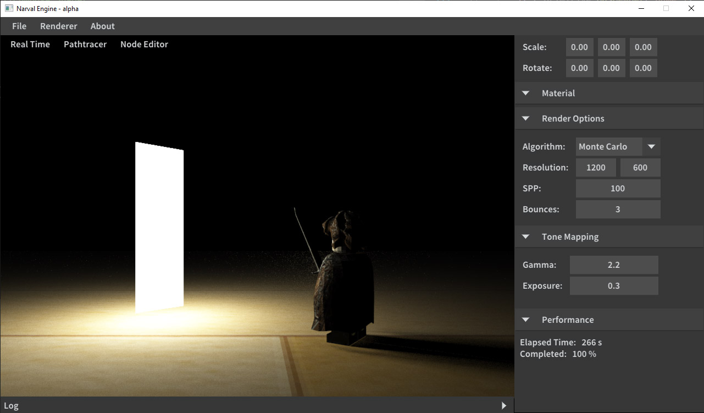
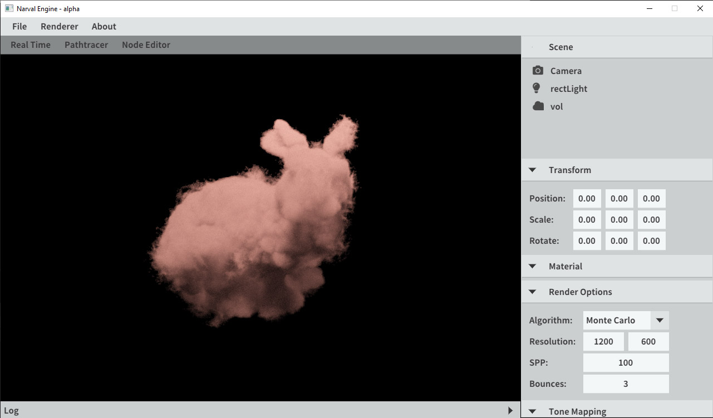

<h1>Narval Engine</h1>

Engine with emphasis in physically based rendering techniques using ray and path tracing. Our goal
is to achieve real-time results with physical foundations. The goal in the near future is to incorporate the Vulkan API into
the abstractation layer and enable the ray tracing extension for better real-time performance and ease of use.

<h2>Features</h2>
<ul>
<li>OpenGL support 
	<ul>
		<li>Abstraction layer over the OpenGL API.</li> 
	</ul>
</li>
<li>Scene editor
	<ul>
		<li>Allows to read from scene files and edit it in real time by changing object and material properties.</li> 
		<li>Can either use PBR in Real time mode or Pathtracer mode for path tracing with tiled rendering live visualization.</li> 
	</ul>
</li>
<li>EXR and PNG frame export 
	<ul>
		<li>Supports exporting the current frame both in EXR and PNG file formats.</li> 
	</ul>
</li>
<li>CPU path tracing
	<ul>
		<li>Multi-threaded CPU path tracing supporting both volumetric and opaque objects.</li>
		<li>Real-time visualization under the Scene Editor.</li>
	</ul>
</li>
<li>GPU path tracing
	<ul>
		<li>Supports only a single volumetric object for now.</li> 
		<li>Real-time visualization under the Scene Editor.</li>
	</ul>
</li>
<li>Scene file descriptor
	<ul>
		<li>Materials supported: Microfacet GGX, Emitters, Volumes in .vdb and .vol format.</li> 
		<li>Primitives supported: Point, Rectangle, Sphere, Volume, OBJ and GLTF files.</li> 
		<li>Pinpoint camera with support to aperture and focus (in path tracing mode only).</li> 
	</ul>
</li>
<li>Node Editor
	<ul>
		<li>Supports Materials editing for surfaces and soon for volumes.</li> 
		<li>Simple Math Operations</li> 
	</ul>
</li>
<li>Dark/Light Mode</li>
</ul>

<h2>Screenshots</h2>

<h2>Scene Editor</h2>
Camera can be moved around using W, A, S, D or dragging the mouse. Q and E for up and down movements. 

<h2>Installation setup</h2>

Tested on windows 7 and 10. <i>Should</i> work with Linux..

<b>Steps to compile:</b>
<ol>
<li>Install <a href="https://github.com/Microsoft/vcpkg">vcpkg</a></li>
<li>vcpkg install openvdb</li>
<li>git submodule init</li>
<li>git submodule update </li>
<li>mkdir build</li>
<li>cd build</li>
<li>cmake .. -DCMAKE_TOOLCHAIN_FILE=PathToYourVCPKG\vcpkg\scripts\buildsystems\vcpkg.cmake</li>
</ol>