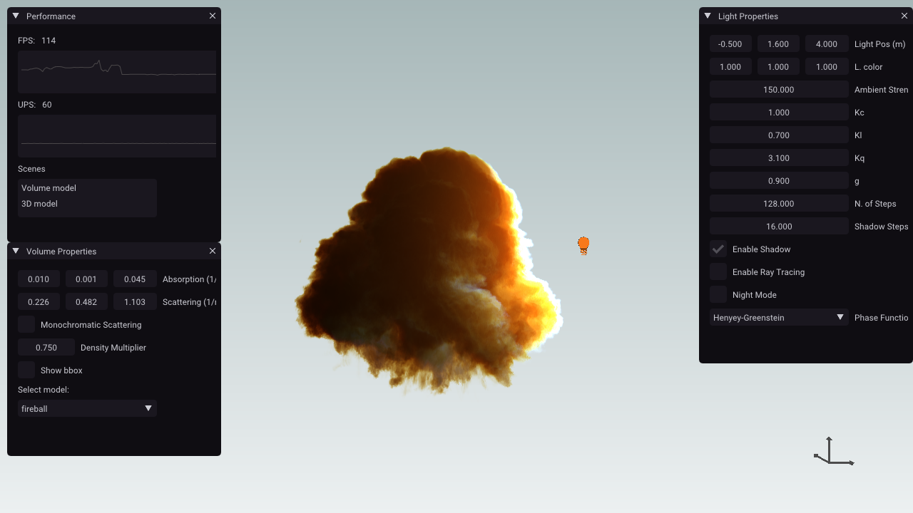
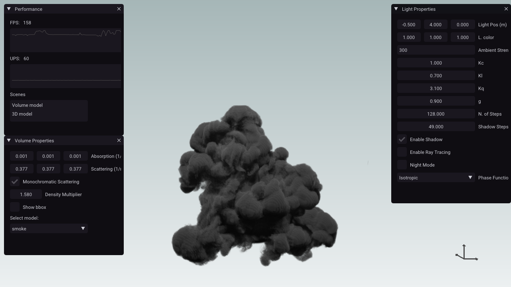
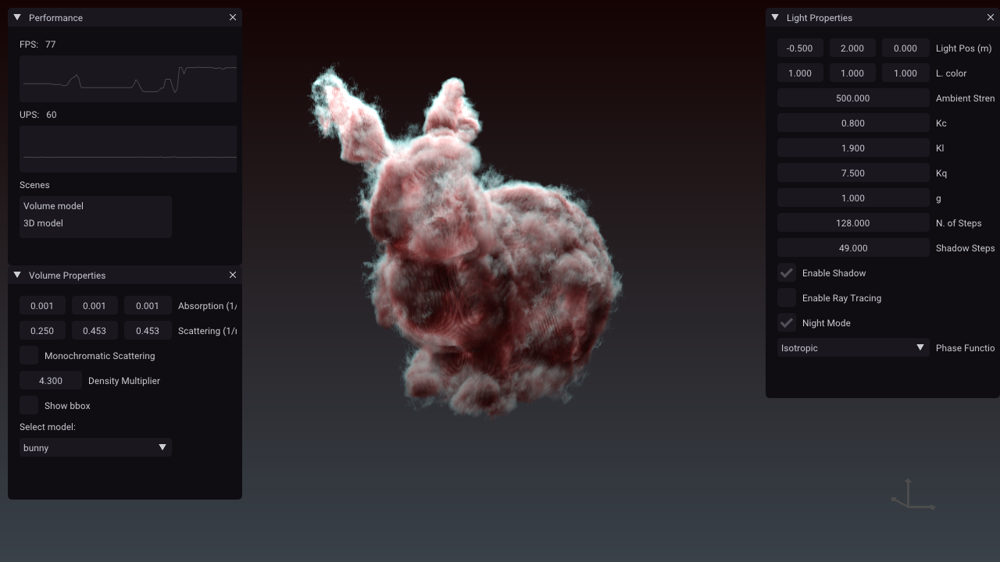

<h1>Volumetric Renderer - Narval Engine</h1>

Small volume renderer supporting real time single scattering and multiple scattering ray tracing using monte carlo.

<h2>Screenshots</h2>

<h2>Camera commands</h2>
W, A, S, D to move.  
Numpad 4, 8, 6, 2 to rotate.  
Q, E to move up and down.  

<h2>Installation setup</h2>

Tested on windows 7 and 10. <i>Should</i> work with Linux by installing openvdb and updating the CMAKE file.

<b>Steps to compile:</b>
<ol>
<li>Install <a href="https://github.com/Microsoft/vcpkg">vcpkg</a></li>
<li>vcpkg install openvdb</li>
<li>git submodule init</li>
<li>git submodule update </li>
<li>mkdir build</li>
<li>cd build</li>
<li>cmake ..</li>
</ol>

<b>Dependencies:</b>
<ul>
<li>OpenVDB 6.2.1</li>
<li>GLFW 3.3</li>
<li>GLM 0.9.9.5 </li>
<li>IMGUI 1.7</li>
<li>STB 1034f5e</li>
<li>GLAD 0.1.30</li>
</ul>

<h2>License</h2>
MIT

<h2>References and Acknowledgments</h2>
OpenVDB samples <a href="https://www.openvdb.org/download/">[Link]</a>  
Moana Cloud Dataset - Walt Disney Animation Studios <a href="https://www.technology.disneyanimation.com/clouds">[Link]</a>  
Physically Based Rendering: From Theory to Implementation - Matt Pharr and Greg Humphreys <a href="http://www.pbr-book.org/3ed-2018/contents.html">[Link]</a>  
Physically Based Sky, Atmosphere and Cloud Rendering in Frostbite - Sébastien Hillaire<a href="https://media.contentapi.ea.com/content/dam/eacom/frostbite/files/s2016-pbs-frostbite-sky-clouds-new.pdf">[Link]</a>  
Production Volume Rendering - SIGGRAPH 2017 Course - Julian Fong et al. <a href="https://graphics.pixar.com/library/ProductionVolumeRendering/paper.pdf">[Link]</a>  
A Survey of Volumetric Illumination Techniques for Interactive Volume Rendering - Daniel Jönsson et al. <a href="https://www.diva-portal.org/smash/get/diva2:710305/FULLTEXT01.pdf">[Link]</a>  
Nubis: Authoring Real-Time Volumetric Cloudscapes with the Decima Engine - SIGGRAPH 2017: Advances in Real-Time Rendering in Games course - Andrew Schneider <a href="https://www.guerrilla-games.com/read/nubis-authoring-real-time-volumetric-cloudscapes-with-the-decima-engine">[Link]</a>  