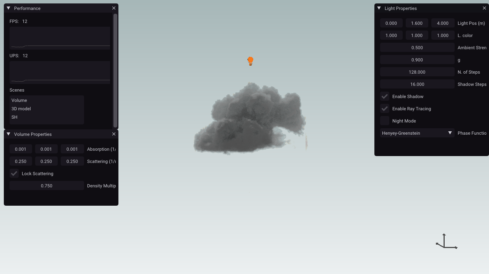
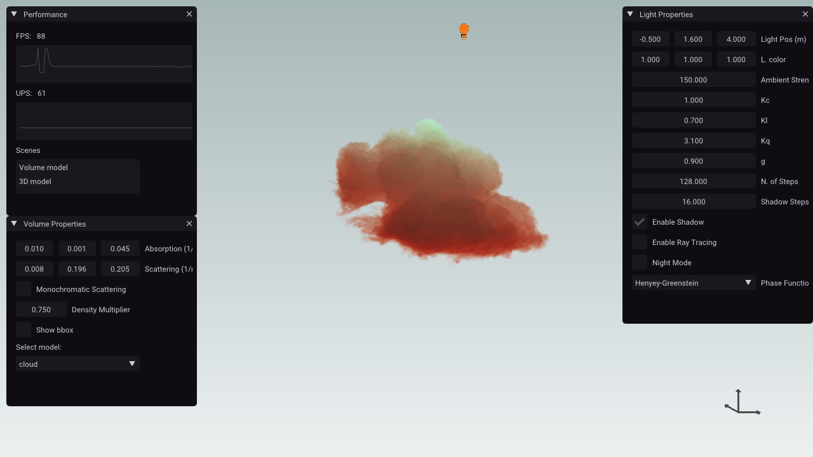

<h1>Volumetric Renderer - Narval Engine</h1>

Small volume renderer supporting real time single scattering and path tracing using monte carlo with multiple scattering.

<h2>Installation setup</h2>

Tested on windows 7 and 10. <i>Should</i> work with Linux by installing openvdb and updating the CMAKE file.

<b>Steps to compile:</b>
<ol>
<li>Install <a href="https://github.com/Microsoft/vcpkg">vcpkg</a></li>
<li>vcpkg install openvdb</li>
<li>git submodule init</li>
<li>git submodule update </li>
<li>mkdir build</li>
<li>cd build</li>
<li>cmake ..</li>
</ol>

<b>Dependencies:</b>
<ul>
<li>OpenVDB 6.2.1</li>
<li>GLFW 3.3</li>
<li>GLM 0.9.9.5 </li>
<li>IMGUI 1.7</li>
<li>STB 1034f5e</li>
<li>GLAD 0.1.30</li>
</ul>

<h2>Screenshots</h2>

More coming soon...

<h2>License</h2>
Soon...

<h2>References and Acknowledgments</h2>
Huge list soon...
